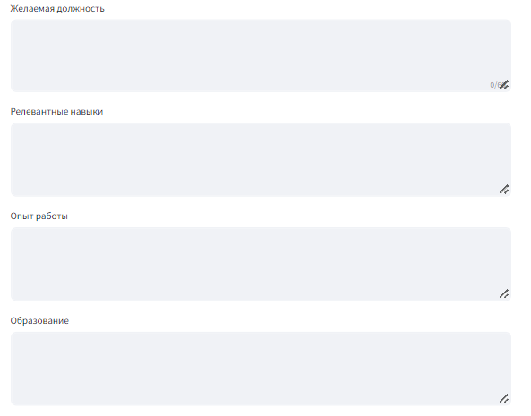
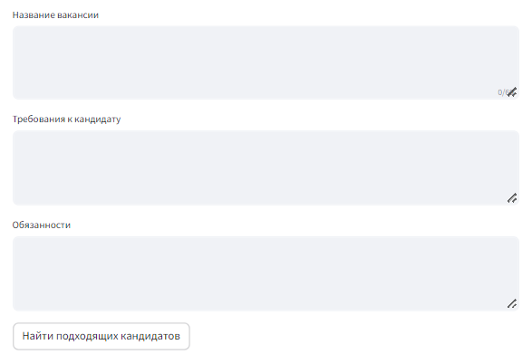
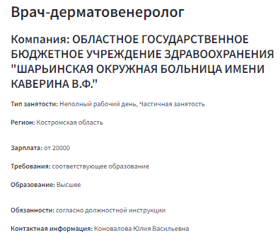
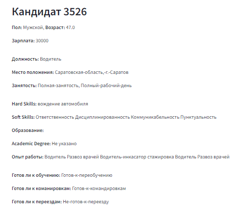

# Матчинг описания вакансий и резюме
## Описание проекта 
Целью этого проекта разработка и реализация программного решения для сопоставления текстовых описаний вакансии и резюме. 
## Основная идея
В работе использовались данные с сайта [Работа России](https://trudvsem.ru/opendata/datasets). 

План:
- Анализ и объединение значимых текстовых признаков, представленных в используемых наборах данных. 
- Предобработка и токенизация полученных текстовых данных
- Проведение экспериментов с разными моделями, получение эмбеддингов при помощи этих моделей
- Оценка результатов исследуемых моделей, выбор наиболее релевантной
- Ранжирование результатов при помощи косинусного расстояния
## Инструменты, используемые для предобработки 
1. bs4 (Beautiful Soup): Был использован для парсинга HTML/XML документов.

2. Pandas: Основная библиотека для анализа данных, что указывает на работу с данными, их очистку и трансформацию.

3. NumPy: Используется для численных операций с массивами и матрицами, что предполагает наличие расчетов или преобразований числовых данных.

4. spaCy: Библиотека для обработки естественного языка, что говорит о работе с текстовыми данными, возможно, для задач токенизации, лемматизации, морфологического разбора или распознавания именованных сущностей.

5. json: Стандартная библиотека для разбора и манипулирования данными JSON, что может быть частью извлечения данных или взаимодействия с API.

6. sentence_transformers: Библиотека для создания эмбеддингов предложений, текста и слов для решения задач семантического сходства, кластеризации и т.д. 
## Исследуемые модели
В рамках работы были исследованы следующие модели:

- [x] TF-IDF

TF-IDF: Статистическая мера для оценки важности слова в документе по его частоте в этом документе и редкости в других документах. Используется для извлечения признаков в текстовом анализе.
- [x] Rubert-tiny-2

RuBERT-tiny2: Упрощенная версия модели BERT, настроенная для русского языка. Применяется для понимания естественного языка, включая классификацию текста и семантический анализ.
- [x] Distiluse-base-multilingual-cased-v1

DistilUSE-base-multilingual-cased-v1: Упрощенная многоязычная версия модели Universal Sentence Encoder. Создает векторные представления предложений, полезные для вычисления семантической близости в разных языках.
- [x] Paraphrase-multilingual-MiniLM-L12-v2

Paraphrase-multilingual-MiniLM-L12-v2: Миниатюрная многоязычная модель для генерации и понимания парафраз. Эффективна в задачах, связанных с анализом схожести различных формулировок одной и той же идеи.

Для работы с моделями было использовано Косинусное расстояние

### Косинусное Расстояние
Косинусное расстояние - это мера, используемая для расчета сходства между двумя ненулевыми векторами в пространстве скалярного произведения, часто используемая в текстовом анализе. Косинус угла между двумя векторами является мерой того, насколько они похожи, независимо от их величины. Косинусное расстояние применимо в оценке семантическом сходства. В текстовом анализе это особенно полезно, поскольку позволяет оценить, насколько похожи два документа по содержанию, независимо от их длины. 

## Результаты экспериментов с моделями

Для оценки качества работы рассмотренных моделей, вручную был размечен небольшой тестовый датасет по шкале от 0 до 1. В качестве метрики оценивания меделей был использован Precision@k. 

**Промежуточный результат обучения моделей:**

|   Модель        | Precision@k| Время инференса|                                  
|:-:|:-:|:-:|
|        TF-IDF     | 0 |0|
|    Rubert-tiny-2  | 0 |0|
|  Distiluse-base-multilingual-cased-v1    | 0 |0|
|  Paraphrase-multilingual-MiniLM-L12-v2 | 0 |0|


## Немного о сервисе
Перед тем как запустить сервис, скачайте архив с данными для работы моделей по [ссылке](https://drive.google.com/file/d/1Xs-4Nw5E16wCLa6AYUwPwSKuhdjVewqX/view?usp=drivesdk).
Архив необходимо распаовать в папку data в корне проекта.

Структура должна иметь следующий вид:

-----------
    vacancies_search
    ├── README.md    
    ├── app.py         <- Скрипт для запуска сервиса
    ├── data (извлечь архив сюда)
    │   ├── data_vector    <- Папка с данными для моделей
    │   └── raw            <- Папка с сырыми csv файлами
    │
    ├── config.py         <- Конфиг для сервиса
    ├── notebooks          <- Jupyter notebooks по экспериментам
    │
    ├── requirements.txt   <- requirements файл 
    │
    ├── service_img        <- Папка с изображениями для README
    │
    └── src                
         ├── __init__.py    
         └── ranking.py    <- Скрипт для расчета подходящих кандидатов/вкансий

Запуск сервиса. В корне проекта:

````
streamlit app.py
````
Сервис работает с:
1. Запросами по вакансиям
2. Запросами по кандидатам

Чтобы активировать режим работы сервиса, необходимо выбрать необходимый вариант из списка


Далее, в зависимости от задачи, заполните поля для поиска.

Работа в режиме поиска вакансий.




Работа в режиме поиска кандидатов.



Далее нажмите на кнопку "Найти подходящие вакансии"/"Найти подходящих кандидатов"

Обработка заполненных вами полей займет некоторое время.

По результатам поиска вакансий будет представлен список топ-10 подходящих по запросу в следующем формате.



При поиске кандидатов вывод будет иметь следующий вид.

