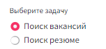

# Матчинг описания вакансий и резюме
## Описание проекта 
Целью этого проекта разработка и реализация программного решения для сопоставления текстовых описаний вакансии и резюме. 
## Основная идея
В работе использовались данные с сайта [Работа России](https://trudvsem.ru/opendata/datasets). 

План:
- Анализ и объединение значимых текстовых признаков, представленных в используемых наборах данных. 
- Предобработка и токенизация полученных текстовых данных
- Проведение экспериментов с разными моделями, получение эмбеддингов при помощи этих моделей
- Оценка результатов исследуемых моделей, выбор наиболее релевантной
- Ранжирование результатов при помощи косинусного расстояния
## Инструменты, используемые для предобработки 
//расписать подробнее инструменты…

- библиотека spacy
- TfidfVectorizer
## Исследуемые модели
В рамках работы были исследованы следующие модели:

- [x] tf-idf
- [x] rubert-tiny-2
- [x] distiluse-base-multilingual-cased-v1
- [x] paraphrase-multilingual-MiniLM-L12-v2
- [ ] …
## Результаты экспериментов с моделями
//расписать методику оценки моделей

**Промежуточный результат обучения моделей:**

|   Модель        |   Метрика качества|                                   
|:-:|:-:|
|        tf-idf     | 0 |
|    rubert-tiny-2  | 0 |
|    distiluse-base-multilingual-cased-v1        | 0 |
|    paraphrase-multilingual-MiniLM-L12-v2| 0 |


## Немного о сервисе
Перед тем как запустить сервис, скачайте архив с данными для работы моделей по [ссылке](https://drive.google.com/file/d/1Xs-4Nw5E16wCLa6AYUwPwSKuhdjVewqX/view?usp=drivesdk).
Архив необходимо распаовать в папку data в корне проекта.

Структура должна иметь следующий вид:

-----------
    vacancies_search
    ├── README.md    
    ├── app.py         <- Скрипт для запуска сервиса
    ├── data (извлечь архив сюда)
    │   ├── data_vector    <- Папка с данными для моделей
    │   └── raw            <- Папка с сырыми csv файлами
    │
    ├── config.py         <- Конфиг для сервиса
    ├── notebooks          <- Jupyter notebooks по экспериментам
    │
    ├── requirements.txt   <- requirements файл 
    │
    ├── service_img        <- Папка с изображениями для README
    │
    └── src                
         ├── __init__.py    
         └── ranking.py    <- Скрипт для расчета подходящих кандидатов/вкансий

Запуск сервиса. В корне проекта:

````
streamlit app.py
````
Сервис работает с:
1. Запросами по вакансиям
2. Запросами по кандидатам

Чтобы активировать режим работы сервиса, необходимо выбрать необходимый вариант из списка



Далее, в зависимости от задачи, заполните поля для поиска.

Работа в режиме поиска вакансий.


Работа в режиме поиска кандидатов.


Далее нажмите на кнопку "Найти подходящие вакансии"/"Найти подходящих кандидатов"

Обработка заполненных вами полей займет некоторое время.

По результатам поиска вакансий будет представлен список топ-10 подходящих по запросу в следующем формате.


При поиске кандидатов вывод будет иметь следующий вид.

